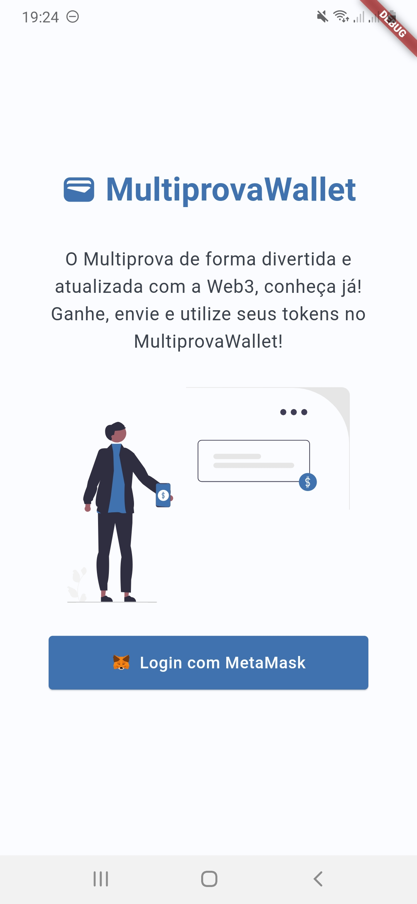
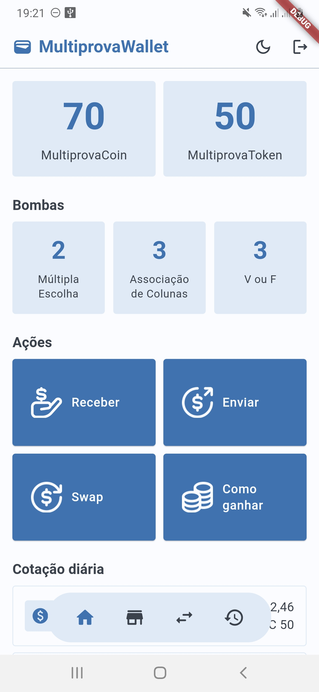
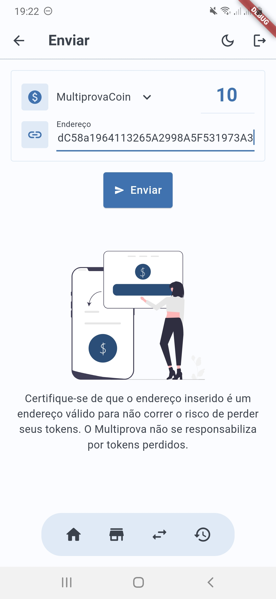
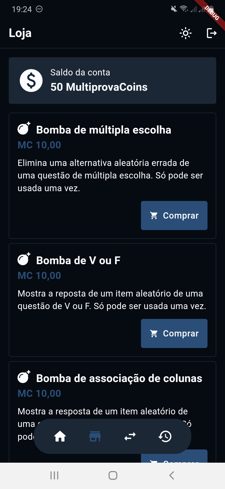
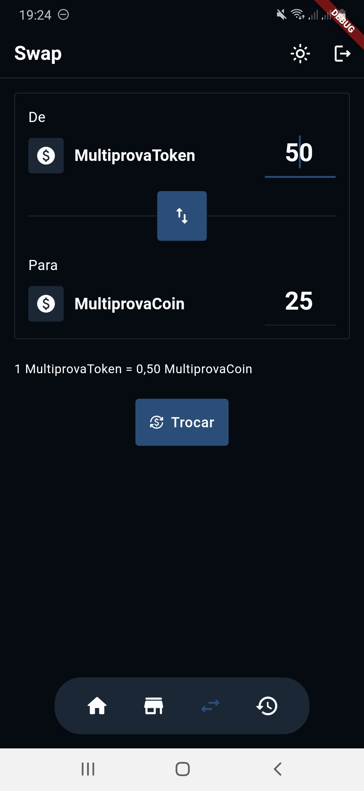
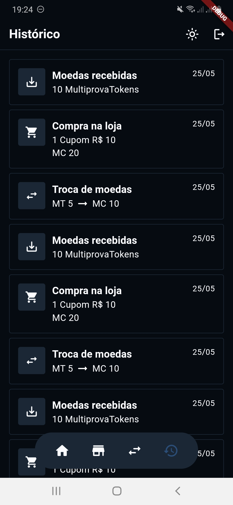

<h1 align="center"> 
	💰 MultiprovaWallet
</h1>

<p align="center">
  <a href="#-sobre-o-projeto">Sobre</a> •
  <a href="#-funcionalidades">Funcionalidades</a> •
  <a href="#-como-executar-o-projeto">Como executar</a> • 
  <a href="#-layout">Layout</a> • 
  <a href="#-tecnologias">Tecnologias</a> • 
  <a href="#-autores">Autores</a>
</p>

<br>

## 💻 Sobre o projeto

Trabalho desenvolvido para a disciplina de Desenvolvimento para Dispositivos Móveis, cujo objetivo é desenvolver em Flutter, um aplicativo para gerenciar tokens (moeda virtual) e comprar itens, a partir de blockchain, para usar na plataforma do Multiprova. O conceito do aplicativo gira em torno de uma ideia de gamificação no Multiprova, a qual o aluno pode ganhar tokens ao responder questões em provas e, com os tokens, comprar utensílios para o ajudar tanto durante o uso da plataforma, como fora dela (como descontos em cantinas, por exemplo).

A essência do aplicativo será a gestão e controle de seus tokens, como uma carteira virtual. Porém, a forma de login, controle de estado do usuário e realização de ações será através do MetaMask, uma carteira virtual baseada na tecnologia Ethereum, que será integrada ao MultiprovaWallet.

**⚠ Observação:** Este repositório não apresenta código fonte do Multiprova.

---

## ⚙ Funcionalidades

- [x] Login com MetaMask
- [x] Listar itens do usuário
  - [x] MultiprovaCoin (moeda comerciável)
  - [x] MultiprovaToken
  - [x] Bombas (para usar em questões de múltipla escolha, associação de colunas ou V ou F)
- [x] Loja para compra de itens
- [x] Listar histórico de ações do usuário
- [x] Conversão entre o MultiprovaToken e MultiprovaCoin
- [x] Enviar moedas para outro usuário
- [x] Mudar tema do aplicativo (claro/escuro)
- [x] Deslogar

---

## 🚀 Como executar o projeto

Para executar o projeto, siga os seguintes passos:

1. É preciso ter o Flutter instalado na sua máquina. Caso não tenha, clique [aqui](https://docs.flutter.dev/get-started/install) e siga os passos de instalação.
2. Conecte um dispositivo mobile pelo cabo USB ou inicie o emulador de um dispositivo que tenha acesso ao Google Play Store.
3. Instale o aplicativo MetaMask no aparelho ou no emulador e crie uma nova conta.
4. No terminal:

```bash
# Clone este repositório
$ git clone git@github.com:fabianapduarte/multiprova_wallet.git

# Acesse a pasta do projeto no terminal/cmd
$ cd multiprova_wallet

# Instale as dependências
$ flutter pub get

# Execute o aplicativo (ou F5 no VSCode com a extensão do Flutter para debug)
$ flutter run
```

---

## 🎨 Layout

Clique [aqui](https://www.figma.com/design/GJ0Eagf5jzYRbhMDnIOvBY/App---MultiprovaWallet?t=ROUlFxLAxdwjl2tG-0) para acessar os protótipos desenvolvidos no Figma.

<p align="center" style="margin-bottom: 8px">
  
  
  
</p>

<p align="center" style="margin-bottom: 8px">
  
  
  
</p>

---

## 🛠 Tecnologias

As seguintes ferramentas foram usadas na construção do projeto:

- Flutter;
- Dart;
- MetaMask.

---

## 👥 Autores

- Alisson Diogo
- Fabiana Pereira
